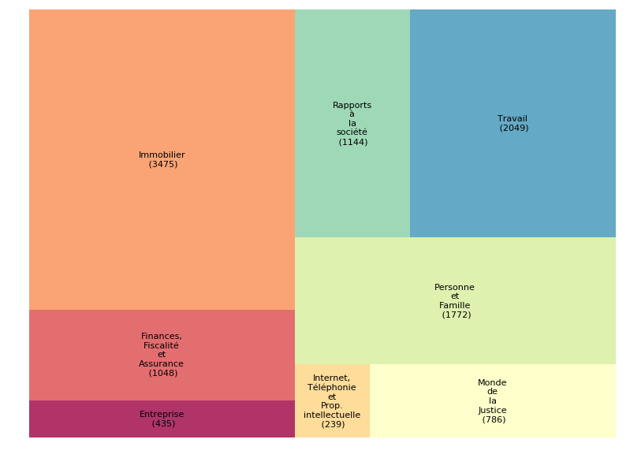
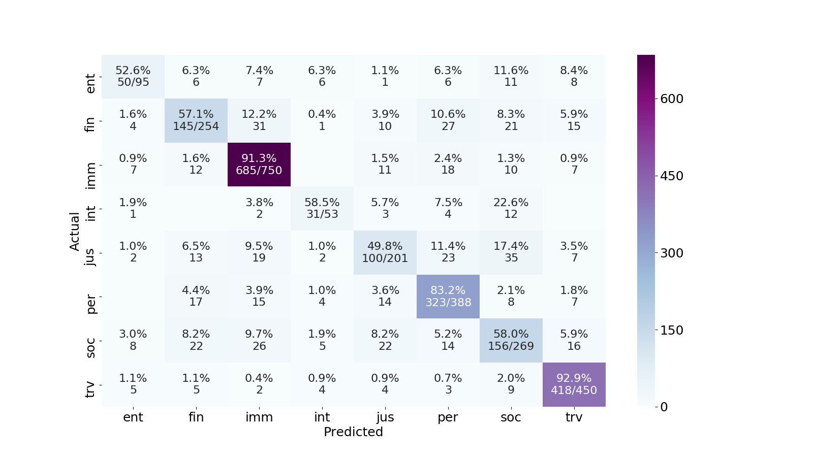

# Catégorisation des questions / réponses

## Info du groupe 
* Membres
    * Chunyang JIANG et Yizhou XU

## Jeu de données 
* Source
    * La sortie `xml` du groupe crawling (irisV4)

* Classes
    * Distribution
    
         
         
    * *Mapping of lables*, cf [settings.py](settings.py)
        
        ```python=
        # See also : settings.py
        DOC_CLASS = {
            "immobilier": "imm",
            "travail": "trv",
            "personne et famille": "per",
            "finances, fiscalité et assurance": "fin",
            "rapports à la société": "soc",
            "monde de la justice": "jus",
            "entreprise": "ent",
            "internet, téléphonie et prop. intellectuelle": "int"
        }
        ```

* Répartition (après déduplication et suppression de items vides):

    | Total    | Train    |     Test |
    | -------- | -------- | -------- |
    | 100%     | 80%      |   20%    |
    |12308     |9848      |   2460   |

----

### Préparation du jeu de données pour entraitement, test et évalutaion
* Entrée : 
    corpus `irisV4` au format `xml`
* Sortie : 
    Une liste des objets `JurQA` sérialisée dans un fichier au format `pickle`
* Scripts
    * [Corpus.py](Corpus.py)
        * modélisation orientée objet des `JurQA` et `Text`
        * requirements: [`treetaggerwrapper`](https://pypi.org/project/treetaggerwrapper/)

    * [prep_data.py](prep_data.py) : 
        * extraction des données à partir du fichier corpus `xml` et serialisation en `pickle`
        * usage : 
            ```python=
            python3 prep_data.py <PATH_TO_XML_SRC> <PATH_TO_PICKLE_DST>
            ```

---
## Sélection de caractéristiques (*features*)

* Type : sac de mots
    * token
    * lemma + pos
    * ngram de lemma (1, 3)
* Représentation numérique: `tf-idf`
* Filtrage et nettoyage, cf [classifier.py](classifier.py)
* Outil
    `TfidfVectorizer` du `sklearn.feature_extraction.text`

---
## Classifieurs et paramétrage
* Classifieurs

    | classifieur | sklearn module |
    | -------- | -------- |
    | Baseline(**BL**)     | DummyClassifier     |
    |Random Forest(**RF**)|RandomForestClassifier|
    |Gradient Boosting(**GB**)|GradientBoostingClassifier|
    |Logistic Regression(**LR**)|LogisticRegression|
    |Naive Bayes(**NB**)|ComplementNB|
    |Support Vector Machines(**SVM**)|LinearSVC|

* Paramétrage
    Outil : `GridSearchCV` du `sklearn`

* Scripts:
    [settings.py](settings.py)
    [classifier.py](classifier.py)
    * usage
        * eg (une meilleure combinaison): 
        
        ```bash=
        python3 classifier.py -c svm -f lemma+pos <path-corpus-train.pkl> -o <dst-model>
        ```
         
        * or in console : `python3 classifier.py --help` :
        
        ```bash=
        usage: classifier.py [-h] [-c {rf,svm,nb,dummy,lr}]
                     [-f {token,lemma,lemma+pos,ngram}] [-s FEATURE_SIZE]
                     [-o OUTPUT]
                     corpus
                     
        positional arguments:
          corpus

        optional arguments:
          -h, --help            show this help message and exit
          -c {rf,svm,nb,dummy,lr}, --classifier {rf,svm,nb,dummy,lr}
                                CLASSIFIERS:
                                    rf = random forest,
                                    svm = linearSVC, linear support vector classification,
                                    nb = navie bayes,
                                    dummy(default) =  baseline classifier,
                                    lr = LogisticRegression
          -f {token,lemma,lemma+pos,ngram}, --features {token,lemma,lemma+pos,ngram}
                                FEATURES:
                                    token(default),
                                    lemma,
                                    lemma+pos,
                                    ngram
          -s FEATURE_SIZE, --feature_size FEATURE_SIZE
          -o OUTPUT, --output OUTPUT

        ```

----
## Évaluation
* jeu de test : `test` (le 20% précédemment séparé aléatoirement)
* **Micro F1-Mesure** avec meilleures configurations

    |       | BL | RF | GB | LR | NB | SVM |
    | -------- | -------- | -------- | ------ | -------- | -------- | ------ |
    |  Token     | ***0.18*** | 0.72 | 0.77 |0.77 | 0.76 | **0.78** |
    |  Lemma+POS     | ***0.18*** | 0.72 | 0.76 |0.78 | 0.76 | **0.78** |
    |  Ngram     | ***0.19*** | 0.72 | 0.75 |0.76 | 0.69 | **0.79** |

* Matrice de confusion pour `SVM` + `lemma+pos`
     

---

## Prédiction
* Scripts
    [make_prediction.py](make_prediction.py)
    [test_make_prediction.py](test_make_prediction.py)
* Fonctionnement
    * utiliser `load_model` (dans `make_predicition`) pour charger le modèle en memoire 
    * **idéalement, si l'on ne voulait pas changer d'autres modèles, ce modèle ne charge q'une seule fois**
    * utiliser `make_prediction` (dans `make_prediction`) pour prédire la classe d'une question en entrée avec le modèle chargé

* Un demo, see also  [test_make_prediction.py](test_make_prediction.py)

    ```python
        import sys
        from make_prediction import *

        path_to_model = sys.argv[1]
        phrase_to_predict = sys.argv[2]
    
        # load the model in memory with the function load_model
        # you only need to load the model once (if you don't intend to change
        # another model)
        model = load_model(path_to_model)

        # make prediction for a phrase with the funciton make_prediction
        # can loop this for more predictions
        predicted_class = make_prediction(model, phrase_to_predict)

        print(predicted_class)
```